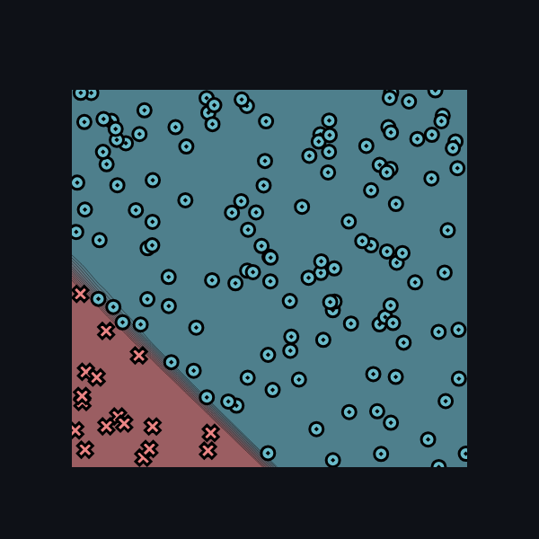

[](https://classroom.github.com/a/YFgwt0yY)
# MiniTorch Module 2


* Docs: https://minitorch.github.io/

* Overview: https://minitorch.github.io/module2/module2/

This assignment requires the following files from the previous assignments. You can get these by running

```bash
python sync_previous_module.py previous-module-dir current-module-dir
```

The files that will be synced are:

        minitorch/operators.py minitorch/module.py minitorch/autodiff.py minitorch/scalar.py minitorch/scalar_functions.py minitorch/module.py project/run_manual.py project/run_scalar.py project/datasets.py

# Simple

- Epoch 1000/1000. Time per epoch: 0.107s. Time left: 0.00s.
- number of points: 150, LR: 1.0,

- Epoch: 0/1000, loss: 0, correct: 0
- Epoch: 10/1000, loss: 101.46342501980408, correct: 80
- Epoch: 20/1000, loss: 87.33895933332167, correct: 80
- Epoch: 30/1000, loss: 90.78171504196212, correct: 95
- Epoch: 40/1000, loss: 45.80289376651239, correct: 140
- Epoch: 50/1000, loss: 49.38963725370807, correct: 132
- Epoch: 60/1000, loss: 47.01574147248801, correct: 132
- Epoch: 70/1000, loss: 40.12448011645192, correct: 133
- Epoch: 80/1000, loss: 29.427515078691574, correct: 136
- Epoch: 90/1000, loss: 33.50815037668536, correct: 134
- Epoch: 100/1000, loss: 24.43702227489571, correct: 139
- Epoch: 110/1000, loss: 27.95919538281604, correct: 137
- Epoch: 120/1000, loss: 23.782572156823257, correct: 139
- Epoch: 130/1000, loss: 23.726537628040404, correct: 139
- Epoch: 140/1000, loss: 21.677151412259224, correct: 139
- Epoch: 150/1000, loss: 20.49926917701899, correct: 139
- Epoch: 160/1000, loss: 20.386714608088045, correct: 139
- Epoch: 170/1000, loss: 19.009866655293877, correct: 142
- Epoch: 180/1000, loss: 18.680429328977212, correct: 142
- Epoch: 190/1000, loss: 17.678604391730072, correct: 142
- Epoch: 200/1000, loss: 17.137357432962656, correct: 142
- Epoch: 210/1000, loss: 16.44116912224333, correct: 142
- Epoch: 220/1000, loss: 15.828044474468088, correct: 142
- Epoch: 230/1000, loss: 15.207420528061672, correct: 142
- Epoch: 240/1000, loss: 14.89881627268259, correct: 142
- Epoch: 250/1000, loss: 14.412079885107245, correct: 142
- Epoch: 260/1000, loss: 13.816603971915054, correct: 142
- Epoch: 270/1000, loss: 13.544316477626912, correct: 142
- Epoch: 280/1000, loss: 13.085676833291627, correct: 142
- Epoch: 290/1000, loss: 12.517896144310493, correct: 143
- Epoch: 300/1000, loss: 12.38031026837426, correct: 143
- Epoch: 310/1000, loss: 12.073161788468145, correct: 143
- Epoch: 320/1000, loss: 11.633803303161178, correct: 143
- Epoch: 330/1000, loss: 11.474179385509991, correct: 143
- Epoch: 340/1000, loss: 11.275931779126143, correct: 143
- Epoch: 350/1000, loss: 10.9623977148954, correct: 143
- Epoch: 360/1000, loss: 10.778971877347297, correct: 143
- Epoch: 370/1000, loss: 10.524187918181784, correct: 143
- Epoch: 380/1000, loss: 10.406138438257818, correct: 143
- Epoch: 390/1000, loss: 10.153970805596694, correct: 143
- Epoch: 400/1000, loss: 10.033499128801726, correct: 143
- Epoch: 410/1000, loss: 9.811668925458946, correct: 143
- Epoch: 420/1000, loss: 9.604566147932326, correct: 143
- Epoch: 430/1000, loss: 9.49981211955556, correct: 143
- Epoch: 440/1000, loss: 9.292497182709774, correct: 143
- Epoch: 450/1000, loss: 9.196860452675235, correct: 143
- Epoch: 460/1000, loss: 9.028824088157606, correct: 143
- Epoch: 470/1000, loss: 8.942021339944462, correct: 143
- Epoch: 480/1000, loss: 8.776695457106493, correct: 143
- Epoch: 490/1000, loss: 8.700614558441302, correct: 143
- Epoch: 500/1000, loss: 8.53953873672979, correct: 144
- Epoch: 510/1000, loss: 8.466955474221157, correct: 144
- Epoch: 520/1000, loss: 8.331855733163014, correct: 145
- Epoch: 530/1000, loss: 8.203528575133895, correct: 145
- Epoch: 540/1000, loss: 8.137269762094908, correct: 145
- Epoch: 550/1000, loss: 8.008033768583426, correct: 145
- Epoch: 560/1000, loss: 7.94694168682751, correct: 145
- Epoch: 570/1000, loss: 7.829713734234139, correct: 145
- Epoch: 580/1000, loss: 7.773700813980858, correct: 145
- Epoch: 590/1000, loss: 7.673131898356847, correct: 145
- Epoch: 600/1000, loss: 7.6144200940873885, correct: 145
- Epoch: 610/1000, loss: 7.515850246553762, correct: 146
- Epoch: 620/1000, loss: 7.462152393297945, correct: 146
- Epoch: 630/1000, loss: 7.371546793401447, correct: 146
- Epoch: 640/1000, loss: 7.321253710468365, correct: 146
- Epoch: 650/1000, loss: 7.236088798365236, correct: 146
- Epoch: 660/1000, loss: 7.1429309582750875, correct: 146
- Epoch: 670/1000, loss: 7.063991187724549, correct: 146
- Epoch: 680/1000, loss: 7.0600124360953815, correct: 146
- Epoch: 690/1000, loss: 6.988702525975901, correct: 146
- Epoch: 700/1000, loss: 6.944271215917692, correct: 146
- Epoch: 710/1000, loss: 6.867744431729528, correct: 146
- Epoch: 720/1000, loss: 6.841065463337856, correct: 146
- Epoch: 730/1000, loss: 6.767036045205901, correct: 146
- Epoch: 740/1000, loss: 6.738492470180682, correct: 146
- Epoch: 750/1000, loss: 6.667656837784492, correct: 146
- Epoch: 760/1000, loss: 6.6415273839971, correct: 146
- Epoch: 770/1000, loss: 6.5743053562138405, correct: 146
- Epoch: 780/1000, loss: 6.5807330156384145, correct: 146
- Epoch: 790/1000, loss: 6.493102523909421, correct: 146
- Epoch: 800/1000, loss: 6.444540708760855, correct: 146
- Epoch: 810/1000, loss: 6.392441614696884, correct: 146
- Epoch: 820/1000, loss: 6.368886442940689, correct: 146
- Epoch: 830/1000, loss: 6.312188250235572, correct: 146
- Epoch: 840/1000, loss: 6.287676173011494, correct: 146
- Epoch: 850/1000, loss: 6.260896072322117, correct: 146
- Epoch: 860/1000, loss: 6.208261984648843, correct: 146
- Epoch: 870/1000, loss: 6.164412379644671, correct: 146
- Epoch: 880/1000, loss: 6.117505264901403, correct: 146
- Epoch: 890/1000, loss: 6.110709202551425, correct: 146
- Epoch: 900/1000, loss: 6.050545573817132, correct: 146
- Epoch: 910/1000, loss: 6.010486895086712, correct: 146
- Epoch: 920/1000, loss: 5.9811132141996755, correct: 146
- Epoch: 930/1000, loss: 5.968390746340395, correct: 146
- Epoch: 940/1000, loss: 5.925112885633044, correct: 146
- Epoch: 950/1000, loss: 5.902802714581167, correct: 146
- Epoch: 960/1000, loss: 5.881041995441494, correct: 146
- Epoch: 970/1000, loss: 5.838916398555236, correct: 146
- Epoch: 980/1000, loss: 5.824423574185816, correct: 146
- Epoch: 990/1000, loss: 5.779598283236212, correct: 146
- Epoch: 1000/1000, loss: 5.757923518365383, correct: 146

# Diag

- number of points: 150, LR: 1.0
- Epoch 1000/1000. Time per epoch: 0.105s. Time left: 0.00s.

- Epoch: 0/1000, loss: 0, correct: 0
- Epoch: 10/1000, loss: 51.87575097672365, correct: 133
- Epoch: 20/1000, loss: 44.02078664197298, correct: 133
- Epoch: 30/1000, loss: 30.465415508903874, correct: 133
- Epoch: 40/1000, loss: 23.34509297900571, correct: 133
- Epoch: 50/1000, loss: 18.727494062644233, correct: 133
- Epoch: 60/1000, loss: 15.39456718614235, correct: 146
- Epoch: 70/1000, loss: 13.100702425855827, correct: 146
- Epoch: 80/1000, loss: 11.415819757687256, correct: 146
- Epoch: 90/1000, loss: 10.132114479497709, correct: 146
- Epoch: 100/1000, loss: 9.122679306891083, correct: 147
- Epoch: 110/1000, loss: 8.30621734541014, correct: 148
- Epoch: 120/1000, loss: 7.6271841123866695, correct: 148
- Epoch: 130/1000, loss: 7.190850495928974, correct: 147
- Epoch: 140/1000, loss: 10.600103999770736, correct: 145
- Epoch: 150/1000, loss: 11.312472579513985, correct: 145
- Epoch: 160/1000, loss: 8.860612841516323, correct: 146
- Epoch: 170/1000, loss: 8.694505638305861, correct: 146
- Epoch: 180/1000, loss: 8.095818393765274, correct: 146
- Epoch: 190/1000, loss: 8.093812096568469, correct: 146
- Epoch: 200/1000, loss: 7.9943099293521245, correct: 146
- Epoch: 210/1000, loss: 7.86184418168029, correct: 146
- Epoch: 220/1000, loss: 7.72657048902795, correct: 146
- Epoch: 230/1000, loss: 7.587966688103725, correct: 146
- Epoch: 240/1000, loss: 7.4372133302294845, correct: 146
- Epoch: 250/1000, loss: 7.286818964652052, correct: 146
- Epoch: 260/1000, loss: 7.142293873244662, correct: 146
- Epoch: 270/1000, loss: 6.99527806991904, correct: 146
- Epoch: 280/1000, loss: 6.866936364490828, correct: 146
- Epoch: 290/1000, loss: 6.74214966722045, correct: 146
- Epoch: 300/1000, loss: 6.619829827160827, correct: 146
- Epoch: 310/1000, loss: 6.513203775869487, correct: 146
- Epoch: 320/1000, loss: 6.381501379215092, correct: 146
- Epoch: 330/1000, loss: 6.266733287384239, correct: 146
- Epoch: 340/1000, loss: 6.155284186823606, correct: 146
- Epoch: 350/1000, loss: 6.045324227974674, correct: 146
- Epoch: 360/1000, loss: 5.957759820201805, correct: 146
- Epoch: 370/1000, loss: 5.845640993211063, correct: 146
- Epoch: 380/1000, loss: 5.731651853960759, correct: 146
- Epoch: 390/1000, loss: 5.639125669349271, correct: 146
- Epoch: 400/1000, loss: 5.548441847210816, correct: 146
- Epoch: 410/1000, loss: 5.453894018753221, correct: 146
- Epoch: 420/1000, loss: 5.358702257982262, correct: 146
- Epoch: 430/1000, loss: 5.268345822751503, correct: 146
- Epoch: 440/1000, loss: 5.204699179813912, correct: 146
- Epoch: 450/1000, loss: 5.3947167465948835, correct: 146
- Epoch: 460/1000, loss: 5.188187385850098, correct: 146
- Epoch: 470/1000, loss: 5.000082971873687, correct: 147
- Epoch: 480/1000, loss: 4.860229624844944, correct: 147
- Epoch: 490/1000, loss: 4.762577291302873, correct: 147
- Epoch: 500/1000, loss: 4.678844158970081, correct: 147
- Epoch: 510/1000, loss: 4.599264158530139, correct: 147
- Epoch: 520/1000, loss: 4.520882442222086, correct: 147
- Epoch: 530/1000, loss: 4.4405668815501596, correct: 148
- Epoch: 540/1000, loss: 4.348593605944962, correct: 148
- Epoch: 550/1000, loss: 4.275463310132683, correct: 148
- Epoch: 560/1000, loss: 4.206855448526713, correct: 148
- Epoch: 570/1000, loss: 4.135592853382232, correct: 148
- Epoch: 580/1000, loss: 4.058222658847317, correct: 148
- Epoch: 590/1000, loss: 3.9758120009639164, correct: 148
- Epoch: 600/1000, loss: 3.8891769666959597, correct: 148
- Epoch: 610/1000, loss: 3.802382064952436, correct: 148
- Epoch: 620/1000, loss: 3.7179469389748787, correct: 148
- Epoch: 630/1000, loss: 3.247338274779473, correct: 148
- Epoch: 640/1000, loss: 2.801625556215617, correct: 148
- Epoch: 650/1000, loss: 2.491303763326123, correct: 149
- Epoch: 660/1000, loss: 2.3444525000802705, correct: 149
- Epoch: 670/1000, loss: 2.3230031947197904, correct: 149
- Epoch: 680/1000, loss: 2.637713243876212, correct: 149
- Epoch: 690/1000, loss: 5.81055697277638, correct: 146
- Epoch: 700/1000, loss: 8.215797201740617, correct: 146
- Epoch: 710/1000, loss: 5.088594093002896, correct: 147
- Epoch: 720/1000, loss: 2.284005409047012, correct: 149
- Epoch: 730/1000, loss: 1.5022467751310722, correct: 150
- Epoch: 740/1000, loss: 1.4337678378025323, correct: 150
- Epoch: 750/1000, loss: 1.390060003100249, correct: 150
- Epoch: 760/1000, loss: 1.3495017221135428, correct: 150
- Epoch: 770/1000, loss: 1.3112527961509979, correct: 150
- Epoch: 780/1000, loss: 1.2750542436550396, correct: 150
- Epoch: 790/1000, loss: 1.2407123337154895, correct: 150
- Epoch: 800/1000, loss: 1.2080675670407233, correct: 150
- Epoch: 810/1000, loss: 1.1769843298352591, correct: 150
- Epoch: 820/1000, loss: 1.147344881533616, correct: 150
- Epoch: 830/1000, loss: 1.1190468970038114, correct: 150
- Epoch: 840/1000, loss: 1.091998223745903, correct: 150
- Epoch: 850/1000, loss: 1.0661141999327832, correct: 150
- Epoch: 860/1000, loss: 1.0413195927136512, correct: 150
- Epoch: 870/1000, loss: 1.0175456054178693, correct: 150
- Epoch: 880/1000, loss: 0.9947308847891341, correct: 150
- Epoch: 890/1000, loss: 0.9728184731018036, correct: 150
- Epoch: 900/1000, loss: 0.9517565493493179, correct: 150
- Epoch: 910/1000, loss: 0.9314963592764227, correct: 150
- Epoch: 920/1000, loss: 0.9119934587502263, correct: 150
- Epoch: 930/1000, loss: 0.8932067427000936, correct: 150
- Epoch: 940/1000, loss: 0.8770293137710974, correct: 150
- Epoch: 950/1000, loss: 0.8654446604657171, correct: 150
- Epoch: 960/1000, loss: 0.8504012491312061, correct: 150
- Epoch: 970/1000, loss: 0.8340510113146875, correct: 150
- Epoch: 980/1000, loss: 0.8176460203129182, correct: 150
- Epoch: 990/1000, loss: 0.7981747702718931, correct: 150
- Epoch: 1000/1000, loss: 0.782631164682402, correct: 150

# Split

- number of points: 150, LR: 1.0
- Epoch 800/800. Time per epoch: 0.105s. Time left: 0.00s.

- Epoch: 0/800, loss: 0, correct: 0
- Epoch: 10/800, loss: 101.5540914914386, correct: 90
- Epoch: 20/800, loss: 101.36043467479857, correct: 90
- Epoch: 30/800, loss: 101.19502772288094, correct: 90
- Epoch: 40/800, loss: 101.01930489968053, correct: 90
- Epoch: 50/800, loss: 100.71521888052514, correct: 90
- Epoch: 60/800, loss: 100.15060099637111, correct: 90
- Epoch: 70/800, loss: 99.27913630491256, correct: 90
- Epoch: 80/800, loss: 97.3265780064586, correct: 90
- Epoch: 90/800, loss: 92.48984116168843, correct: 104
- Epoch: 100/800, loss: 87.75182875166061, correct: 103
- Epoch: 110/800, loss: 94.77137748592946, correct: 90
- Epoch: 120/800, loss: 90.92531898523413, correct: 98
- Epoch: 130/800, loss: 87.84003684273227, correct: 100
- Epoch: 140/800, loss: 85.75818080520726, correct: 104
- Epoch: 150/800, loss: 82.19598989557454, correct: 105
- Epoch: 160/800, loss: 79.86189852963778, correct: 108
- Epoch: 170/800, loss: 78.6015565786848, correct: 110
- Epoch: 180/800, loss: 75.4909835177576, correct: 114
- Epoch: 190/800, loss: 74.47105152050159, correct: 114
- Epoch: 200/800, loss: 73.75240256502155, correct: 114
- Epoch: 210/800, loss: 73.30852141651998, correct: 114
- Epoch: 220/800, loss: 71.67430570171632, correct: 115
- Epoch: 230/800, loss: 67.93212213505497, correct: 117
- Epoch: 240/800, loss: 65.30542025789741, correct: 117
- Epoch: 250/800, loss: 65.5431081563378, correct: 115
- Epoch: 260/800, loss: 77.26513882039367, correct: 114
- Epoch: 270/800, loss: 64.80754127333076, correct: 118
- Epoch: 280/800, loss: 64.21472640499799, correct: 123
- Epoch: 290/800, loss: 34.457308540311125, correct: 139
- Epoch: 300/800, loss: 40.63517097054286, correct: 126
- Epoch: 310/800, loss: 90.54839859224273, correct: 105
- Epoch: 320/800, loss: 24.980924424330606, correct: 147
- Epoch: 330/800, loss: 37.22104058090547, correct: 125
- Epoch: 340/800, loss: 64.71217609103341, correct: 111
- Epoch: 350/800, loss: 93.54741334371654, correct: 102
- Epoch: 360/800, loss: 34.36877219927612, correct: 132
- Epoch: 370/800, loss: 30.785634818157646, correct: 142
- Epoch: 380/800, loss: 20.952283019961147, correct: 144
- Epoch: 390/800, loss: 21.107532811653932, correct: 148
- Epoch: 400/800, loss: 27.348599171313783, correct: 148
- Epoch: 410/800, loss: 101.60797114586661, correct: 101
- Epoch: 420/800, loss: 23.96127944017684, correct: 138
- Epoch: 430/800, loss: 25.6686466409639, correct: 147
- Epoch: 440/800, loss: 53.05794460337163, correct: 124
- Epoch: 450/800, loss: 21.052901353749515, correct: 142
- Epoch: 460/800, loss: 18.91834006464158, correct: 148
- Epoch: 470/800, loss: 153.74017861666974, correct: 85
- Epoch: 480/800, loss: 49.70944005367247, correct: 130
- Epoch: 490/800, loss: 13.930364125558347, correct: 147
- Epoch: 500/800, loss: 21.491971909734737, correct: 138
- Epoch: 510/800, loss: 22.276828424119866, correct: 140
- Epoch: 520/800, loss: 15.076858944383986, correct: 145
- Epoch: 530/800, loss: 32.9799306778762, correct: 134
- Epoch: 540/800, loss: 14.741363998091952, correct: 148
- Epoch: 550/800, loss: 69.41942920555398, correct: 118
- Epoch: 560/800, loss: 11.775273306439178, correct: 147
- Epoch: 570/800, loss: 11.003198579475947, correct: 147
- Epoch: 580/800, loss: 27.61229007672304, correct: 137
- Epoch: 590/800, loss: 16.513561460976604, correct: 148
- Epoch: 600/800, loss: 9.624338345767107, correct: 150
- Epoch: 610/800, loss: 8.171970208221586, correct: 150
- Epoch: 620/800, loss: 7.777112395350371, correct: 147
- Epoch: 630/800, loss: 16.189285175768305, correct: 144
- Epoch: 640/800, loss: 14.287573101378399, correct: 147
- Epoch: 650/800, loss: 8.867747432152738, correct: 150
- Epoch: 660/800, loss: 7.673252432019277, correct: 150
- Epoch: 670/800, loss: 6.793875365669487, correct: 150
- Epoch: 680/800, loss: 6.119440753188823, correct: 150
- Epoch: 690/800, loss: 5.629496285526099, correct: 150
- Epoch: 700/800, loss: 11.389353994566768, correct: 145
- Epoch: 710/800, loss: 11.276640165674602, correct: 147
- Epoch: 720/800, loss: 8.001274139710063, correct: 148
- Epoch: 730/800, loss: 6.997479686483199, correct: 148
- Epoch: 740/800, loss: 6.698444954933926, correct: 147
- Epoch: 750/800, loss: 76.86871401774818, correct: 131
- Epoch: 760/800, loss: 23.435362081181896, correct: 137
- Epoch: 770/800, loss: 9.140364072209271, correct: 150
- Epoch: 780/800, loss: 7.479363457439376, correct: 150
- Epoch: 790/800, loss: 6.579022847421649, correct: 150
- Epoch: 800/800, loss: 5.908137399247399, correct: 150

# Xor

- number of points: 100, LR: 1.0, Hidden Layers: 4.0
- Epoch 500/500. Time per epoch: 0.160s. Time left: 0.00s.

- Epoch: 0/500, loss: 0, correct: 0
- Epoch: 10/500, loss: 69.76128276366696, correct: 54
- Epoch: 20/500, loss: 69.74445078565078, correct: 54
- Epoch: 30/500, loss: 69.71800171489663, correct: 54
- Epoch: 40/500, loss: 69.66222499362284, correct: 54
- Epoch: 50/500, loss: 69.550309782565, correct: 54
- Epoch: 60/500, loss: 69.35934702956033, correct: 54
- Epoch: 70/500, loss: 69.01904707183034, correct: 54
- Epoch: 80/500, loss: 68.3827276245001, correct: 54
- Epoch: 90/500, loss: 67.0164067486911, correct: 55
- Epoch: 100/500, loss: 64.28539811498706, correct: 75
- Epoch: 110/500, loss: 65.82527985824784, correct: 68
- Epoch: 120/500, loss: 67.04333558857222, correct: 60
- Epoch: 130/500, loss: 67.0965413659578, correct: 60
- Epoch: 140/500, loss: 60.756608542077736, correct: 71
- Epoch: 150/500, loss: 57.476879668793366, correct: 74
- Epoch: 160/500, loss: 65.72093721141614, correct: 61
- Epoch: 170/500, loss: 51.9926750201054, correct: 76
- Epoch: 180/500, loss: 60.16434395342628, correct: 62
- Epoch: 190/500, loss: 48.53312558365525, correct: 82
- Epoch: 200/500, loss: 56.25100950591046, correct: 72
- Epoch: 210/500, loss: 83.31918775843378, correct: 50
- Epoch: 220/500, loss: 42.09956292843132, correct: 92
- Epoch: 230/500, loss: 60.253928804998246, correct: 66
- Epoch: 240/500, loss: 40.347695419967245, correct: 89
- Epoch: 250/500, loss: 59.75804382694646, correct: 61
- Epoch: 260/500, loss: 54.184425016111526, correct: 72
- Epoch: 270/500, loss: 53.09792126172998, correct: 74
- Epoch: 280/500, loss: 51.85744610802867, correct: 73
- Epoch: 290/500, loss: 50.78305812634051, correct: 69
- Epoch: 300/500, loss: 48.38312203579561, correct: 73
- Epoch: 310/500, loss: 34.19039228783773, correct: 93
- Epoch: 320/500, loss: 45.71474221532934, correct: 82
- Epoch: 330/500, loss: 49.31456607692227, correct: 74
- Epoch: 340/500, loss: 30.862957340441138, correct: 90
- Epoch: 350/500, loss: 52.89975461870159, correct: 76
- Epoch: 360/500, loss: 23.569031271849347, correct: 95
- Epoch: 370/500, loss: 31.21341038410431, correct: 87
- Epoch: 380/500, loss: 50.32059536555154, correct: 79
- Epoch: 390/500, loss: 22.405643843947633, correct: 94
- Epoch: 400/500, loss: 24.556611997303918, correct: 91
- Epoch: 410/500, loss: 20.444906196601686, correct: 94
- Epoch: 420/500, loss: 38.08510791155278, correct: 86
- Epoch: 430/500, loss: 51.428685449705696, correct: 78
- Epoch: 440/500, loss: 30.20896418553236, correct: 85
- Epoch: 450/500, loss: 28.813976323547628, correct: 85
- Epoch: 460/500, loss: 17.500110760721597, correct: 96
- Epoch: 470/500, loss: 37.15071101272783, correct: 86
- Epoch: 480/500, loss: 17.360075220896984, correct: 95
- Epoch: 490/500, loss: 16.789849669846017, correct: 97
- Epoch: 500/500, loss: 26.27677451876731, correct: 90